# **Full Stack App (Part A)**

## **Website Links**
**Website URL:** https://sports4us.netlify.app/

**Backend URL:** https://sports4us-api.herokuapp.com/

**GitHub FrontEnd URL:** https://github.com/Feng-CA/sports-4-us_react

**GitHub BackEnd URL:** https://github.com/Feng-CA/sports-4-us_rails-api

## **Description of the application**

Sports-4-Us is an App that that helps people from all walks of life, to **join** and **participate** in a wide variety of **sporting activities** of their *choice* and at times *flexible* for them.

The figure below shows how a user can typically use the Sport4Us app to eventually particiapte in activities.

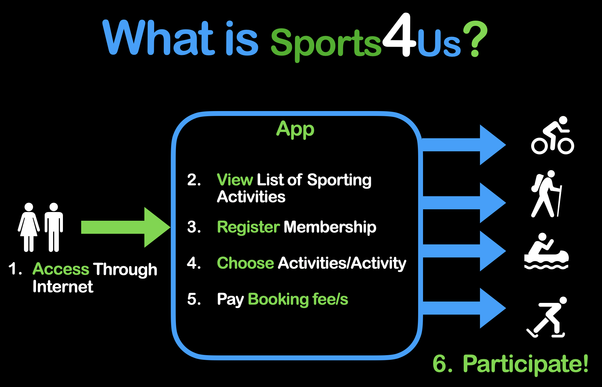

### **Purpose**

The main purpose behind Sports-4-Us is to try build an Application that will make it easier for more people to  ***participate in sports***.

Studies show that living an active life style through sports participation generally improves lives of individuals in the following ways:

- Improved Mental Health and Social Wellness,
- Improved Physical Health and Fitness,
- Improved Sleep,
- Improved Energy Levels and
- Reduced risk of serious illnesses and chronic diseases.

All these factors improve the quality of life and the capacity of an individual to be more productive. Hence, with more individuals taking part in sports, it helps to build a **happier**, **healthier** and **more productive world** and one that will need less money to be spend on health services and health infrastructure. 

Despite all the well known benefits that come with sports participation, many individuals experience numerous barriers when trying to take part in sports. Some of the barriers experienced by individuals, as mentioned by the Australian Sports Commission *(Australian Sports Commission, 2022) are the following:

- **Time:** Families and individuals are getting busier by the day and finding less time to commit to sporting activities. Lot of sporting activities have very inflexible schedule that can be unsuitable for individuals involved in full time work and families.
- **Cost:** The cost to register for sports can be quite unaffordable for many individuals and families
- **Enjoyment:** Not everybody is drawn to sports that are competitive in nature and hence this might deter many individuals from taking part. Some people are looking for enjoyment and fitness only.
- **Self-Esteem:** Some individuals may not feel good enough for sports and hence might stay away from sports.
- **Risk:** Some people may feel that sports could be dangerous and stay away to risk injuries.
- **Awareness:** Individuals may not be aware of where the sporting activities are due to not being well connected socially.
- **Delivery:** Some sporting activities that are available might not be delivered well and informative enough for the general public feel interested.

Sports-4-Us tries to reduce all these barriers and increase participation by providing the following benefits:

- **Easily Accessible:** Sports-4-Us App will be easily accessible on the internet for anybody that can access the internet at no cost. This will ensure that almost all people and even people that were in the dark previously, with regard to sporting information can easily be aware. 
- **Affordable:** Joining fees and cost to join activities will be at a minimum because there is no need to employ too many people or maintain too much infrastructure for the sporting activities. Few admin personnel and sports organisers can service all the activities which keeps workers wages at a minimum. Facilities and programs are rented or accessed only when needed and hence there is no need to charge members high joining fees to maintain or buy facilities. 
- **Easy to Join:**  Joining only requires a very easy Sign up process and a minimal joining fee.
- **Informative:** The App will have extensive information on each activity which will ensure that people from all walks of live will be made fully aware of the details of each program and how that could fit into everybody’s personal lives. 
- **Flexibility:** For people that have time constraints and inflexible working hours, it works ideal because joining the app does not require a long term commitment to any activity. People can choose to join short term activities when they choose, withdraw after that and later join again when they are free again.
- **Easy to Contact:** The app provides contact forms and messaging Channels to communicate with administrators and organisers when quite easily. This will clear any doubts, issues or concerns people may have around things like self-esteem and risks.
- **Lots of Choice:** Joining the app allows the user to choose from a wide range of activities throughout their membership which allows them to experience various sports and opportunities to network with lots of different people.

A summary of everything mentioned so far is shown in the image below:

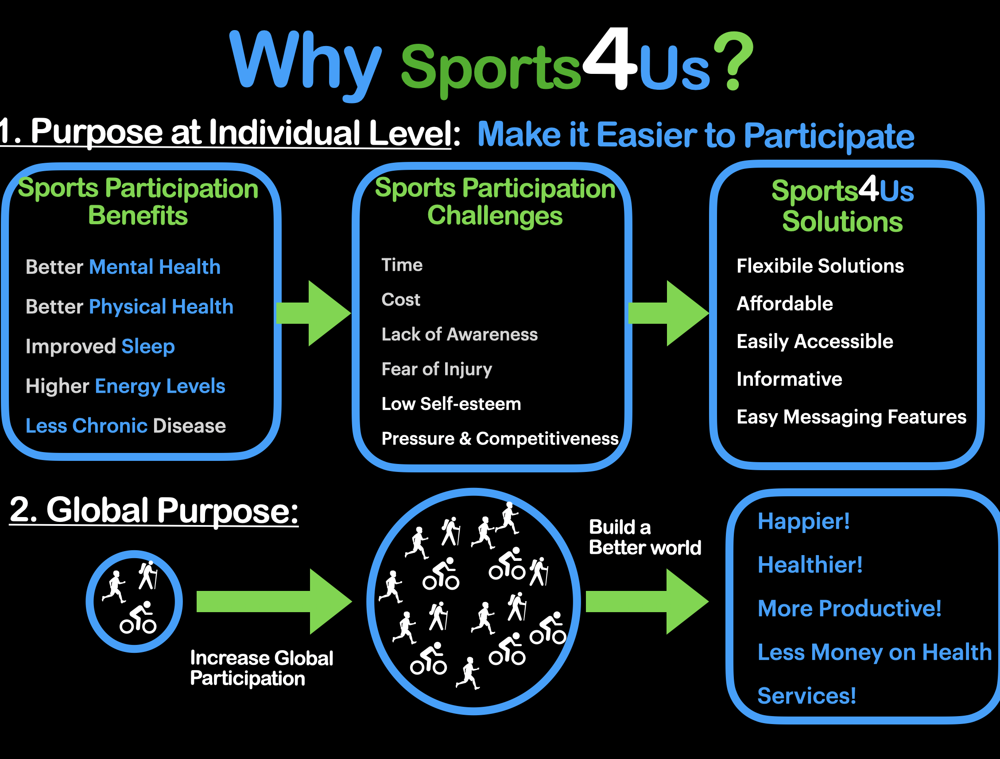

**Reference**

Australian Sports Commision (2022) Drivers and barriers of participation. Available at: https://www.sportaus.gov.au/participation/drivers/barriers
(Accessed: 12 July 2022).

### **Functionality / features**

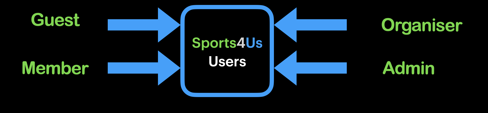

In order to understand the full functionality of Sport-4-Us App, it is important to examine it from the perspective of each of the four different types of users, that will be using the Application:

**Guest Users**

Guest Users are anybody that uses the Application and are not Signed up as a User and hence cannot Log In to the application under any capacity. These users can still use the application but to a much limited capacity. They can more specifically do the following:

- View the Home Page
- Explore through the different Categories of  Activities available and also the specific Activities within each category in detail.
- They can also contact the Administrators of the application by typing a message in the Contact Page.
- If they later decide to be a Member or an Organiser of the Activities, they can then Sign Up using the Sign up Page.

All the above features are what has been decided to be part of the ***Minimum Viable Product*** for design of the Application. Once all that has been implemented the developers hope to implement the following to enrich the Application:

- a payment system during Sign Up to ensure that the users can be charged a ‘Joining fee’ to secure membership.
- A Weather Forecast for the day each of the activity will take place.

**Members**

Members are the ones who will be choosing from the different activities available and eventually participating in them. To be more specific, they will have access to all the following features:

- All the features that are available to Guest Users,
- Signing In as a User,
- Booking suitable activity or activities,
- Paying for suitable activities to Participate
- Viewing Personal Messages from other members, organisers and Administrators,
- Messaging and replying to other members, organisers and Administrators using direct messaging,
- Posting messages in different Messaging channels
- Editing their Personal Profiles,
- Viewing list of Activities that they will be participating in.
- Viewing a list of all the Members and Organisers registered in the App.

**Organisers**

Organisers are the ones who will be in charge of organising the different activities and communicating with members regarding details of each activity. To be more specific, the will have access to all the following features:

- All the features that are available to Guest Users,
- Signing In as a User,
- Viewing Personal Messages from other members, organisers and Administrators,
- Messaging and replying to other members, organisers and Administrators using direct messaging,
- Posting messages in different Messaging channels
- Editing their Personal Profiles,
- Viewing list of Activities that they will are Organising.
- Viewing a list of all the Members and Organisers registered in the App.

All the above features are what has been decided to be part of the ***Minimum Viable Product*** for design of the Application. Once all that has been implemented the developers hope to implement the following to enrich the Application:

- The Organisers will be able to Create their own Activities and submit it to Administrators for Approval.
- They will have a page to view all the Activities that have been created but are still waiting to be approved by the Administrators.

**Administrators**

Administrators are the people that are responsible for administrative functions regarding the application. To be more specific they will have access to the following features:

- All features that are available to Guest users.
- Signing In as a User,
- Viewing Personal Messages from other members, organisers and Administrators,
- Messaging and replying to other members, organisers and Administrators using direct messaging,
- Posting messages in different Messaging channels
- Editing Personal Profiles of All users,
- Deleting Users
- Viewing a list of all the Members and Organisers registered in the App.
- Creating Activities
- Assigning Users as Members and Organisers,

All the above features are what has been decided to be part of the ***Minimum Viable Product*** for design of the Application. Once all that has been implemented the developers hope to implement the following to enrich the Application:

- Admin will be in a position to Accept or Reject Activities created by Organisers.
- Admin will be able to view a list of Activities that are waiting to be approved.

### **Target audience**

This app will be aimed for anybody from any backround above the age of 18 who would love to participate in sport for a healthy lifestyle and closer social interaction with other peopele that share the same interests.

### **Tech stack**

- Front-end: HTML5, CSS3, REACT.JS, JavaScript, JSX, AXIOS, Material-ui.

- Back-end: Rails API

- Database: postgreSQL

- Deployment:
1. Front-end: Netlify
2. Back-end: Heroku

- Testing:
1. Front-end: Jest
2. Back-end: Rspec

Project management tools: Trello, Discord

Utilities: diagrams.net, Balsamiq Wireframes

DevOps: Git, Github, VS Code

## **Dataflow Diagrams**

### **DFD for All Users**

As shown above all users can view the Home Page, Sporting Categories, view Individual Category Activities, details of the Activities  and the Contact Page. All Activities data will be retrieved from the Activities Table in the Database. Data regarding the weather conditions will be retrieved from an external Weather API. However this is currently not part of the Minimum Viable Product Design.

### **DFD for Guest Users Only**

As shown above Guest Users can sign up and send the data to be stored in a Users Table in the database. This data can also be retrieved to set the User to a Logged-in condition. During Sign up the app could be set up to charge a fee. This will would mean data will have to be sent to an externaly payment API. However this is currently not part of the Minimum Viable Product Design.

### **DFD for All Logged-In Users**

This shows how data can be sent to "Sign Out" a user and how a user can View the page that shows the full Members' list. Data for the Member's List is obtained from the Users Table in the database. After Sign out the user is taken to the Home page.

Figure 3.2 Shows how messages are read and posted in the messaging channels. Data here is stored and retrieved from the Messaging Channel table in the database.

Figure 3.3 Shows how personal messages are read from the Inbox table in the database. 

Figure 3.4 Shows how Personal messages can be read and replied to. All data is retrieved and stored from the Inbox table.

Figure 3.5 Shows how a new message can be composed and sent to another member. Again this message will be stored in the Inbox table in the database

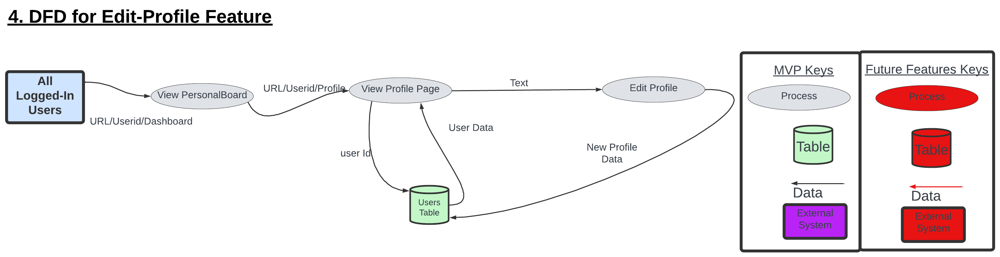

This shows how a logged in User can Edit their profole. details in the Users table is retrieved, Edited and Stored.

### **DFD for Organiser Users**

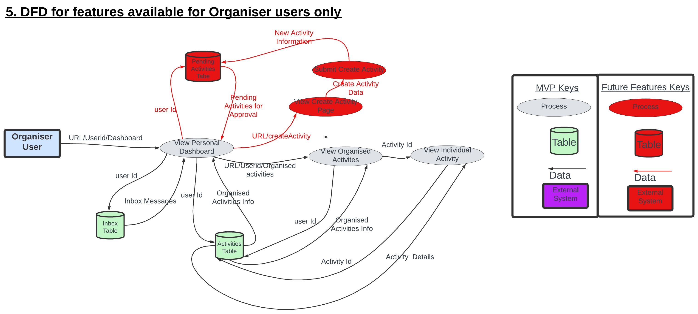

This diagram show show Organisers can retrieve information on their organised activities from the Activities Table. It also shows a feature that is not MVP at the momment - Create Activity. This will be stored in a new table called "Pending Activity Table"

### **DFD for Member Users**

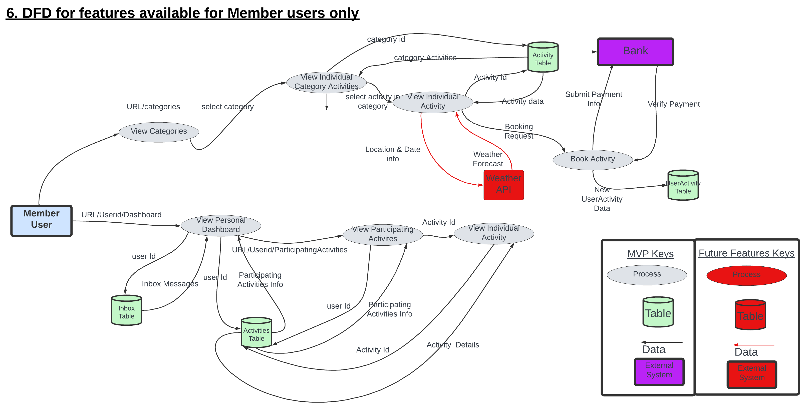

This shows how data flows to all the different tables in the database when Member users book activities and view activities they are participating in.

### **DFD for Admin Users**

This shows how data is stored into the Activities Table in the database after the Admin Creates Activities in the Create activity Page. It also shows how Admin can edit User Profiles from the Members' page by accessing and storing information from the Users table.

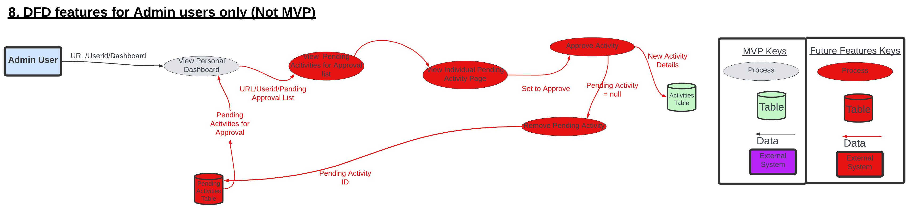

This feature that is currently not MVP will require information to be retrieved from a new table called "Pending Activity table"  and be stored in the Activity table in the database.

## **Application Architecture Diagram**

The one thing to note in the above Architecture Diagram is that the implementation of the system accessing the Weather API is not part of the MVP(Minimum Viable Product) design. It is a feature that will be implemented once all the MVP features have been sucessfully implemented.

## **User Stories**

### **Initial market research:**

### **Final market research:**

| AS A..    | I WANT TO..                                                       | SO THAT..                                                                             |
|-----------|-------------------------------------------------------------------|---------------------------------------------------------------------------------------|
| Guest     | I want to explore various sporting activities.                    | I can decide whether I should sign up as a member to attend sports activities.        |
| Guest     | I want to sign up as a member.                                    | I can book any available sports activity/activities that I will like to take part in. |
| Guest     | I want to contact admin of this website.                          | I can make some enquiries.                                                            |
| Member    | I want to manage my profile.                                      | I can keep it up to date.                                                             |
| Member    | I want to inquire about a particular activity with the organiser. | I can know more information about the activity like equipment, location etc.          |
| Member    | I want to make a payment after booking the activity.              | I can get a ticket to attend the activity.                                            |
| Member    | I want to message other members, organisers or admin.             | We can communicate directly.                                                          |
| Member    | I want to see my personal dashboard.                              | I can find all my registered activities and messages.                                 |
| Member    | I want to see all members' briefing information.                  | I can find someone from the same location, who has the same interests.                |
| Member    | I want to be an activity organiser                                | I can organise my own activities.                                                     |
| Organiser | I want to see my dashboard.                                       | I can see all my organised activities and messages.                                   |
| Organiser | I want to see all members' briefing information                   | I can monitor what activities is more popular.                                        |
| Organiser | I want to reply to messages from members.                         | I can quickly answer all enquiries related to the activity.                           |
| Admin     | I want to have a dashboard.                                       | I can manage all activities, messages and members in one place.                       |
| Admin     | I want to be able to manage activities.                           | I can create, update and delete activity as needed                                    |
| Admin     | I want to be able to manage member's profile.                     | I can keep it up to date or delete the member.                                        |
| Admin     | I want to be able to answer general enquiries.                    | I can reply the messages sent to me from the contact page.                            |

## **Wireframes for multiple standard screen sizes, created using industry standard software**

This section shows all the wireframes that have been designed for Sports4Us App. The wireframes have been separated into four sections:

- Wireframes - User Not Logged-In
- Wireframes - Member Login
- Wireframes - Organiser Login
- Wireframes - Admin Login

Each section will first provide a sitemap on how the webpages will 'flow' under the logged in/not logged-in condition and then the wireframes for each of the webpages shown in the sitemap will be displayed in order. However if any of the webpages in the sitemap is a repeat and had been shown before, then it will not be repeated again.

### **A. Wireframes - User Not Logged-In**

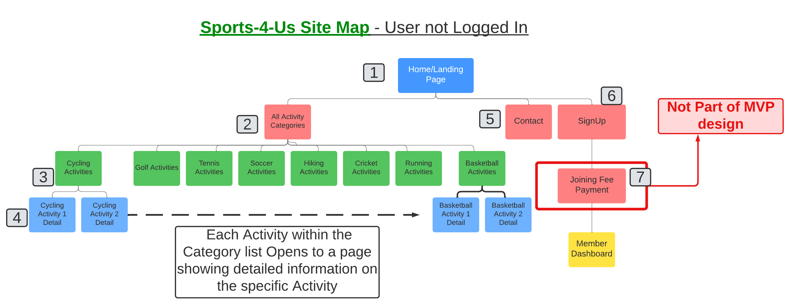

As shown in the sitemap any user can access "All Activity Categories", "Contact" and "Sign-up" from the Home Page. Any user can perform a sign up to access a Member Dashboard page. In the future a payment system for Sign up will be implemented, however as shown this is not part of the MVP currently. The user can also gain access to a page showing the different categories of sports and from here the user can access a page with more detailed information on each Sporting Activity.

**1 - Home Page**

The home page will have some sporting images in the background with buttons and links to all the pages accessible from the home page, as shown in the site map. The navbar on top will change to a hamburger menu on the mobile view, which will be the case in all the wireframes.

**2 - All Activity Categories**

This page will display sporting cateory links with images of the particular sport. It will display 4x2 categories on the desktop, 2x2 on the tablet and finally just 1 at a time in the mobile view.
 
**3 - Category Activities**

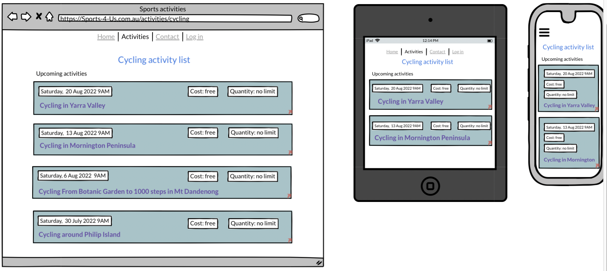

Once a category (cycling in this example) is clicked this page will appear shing a list of all the activities within the category and some brief detail on each.

**4 - Activity Detail**

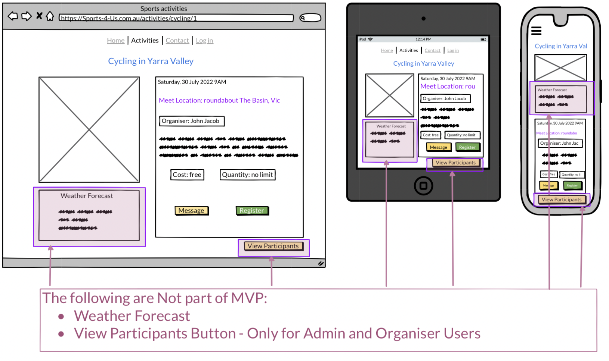

This page will show full details ont he activity and links to Register, View Participants and Message. There is a Weather forecast feature which is not part of the MVP design and will be considered in the future. View Paricipants will also be a non-MVP feature which will be accessible only to admin and organisers.

**5 - Contact Page**

THis is a page that is very similar for all screenwidth and messagees here will go to the Admin Email.

**6 - SignUp Page**

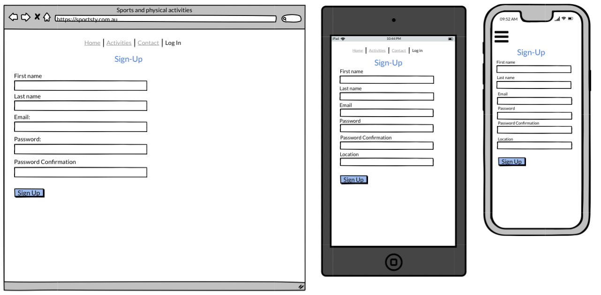

As shown the Sign up page lets the user input information required for a basic sign up.

**7 - Joining Fee Payment(Not MVP)**

This feature will require accessing an external page like "stripe" and hence will not be designed here. It should also be noted that it is not part of the MVP design at the momment.

### **B. Wireframes - Member Login**

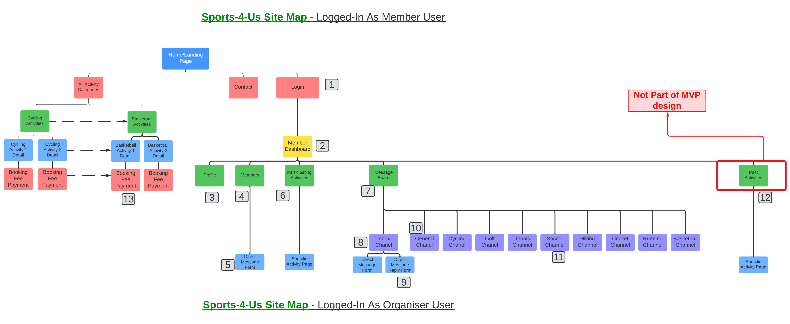

The above sitemap is an extension of the one shown from the previous section. This shows all the webpages that can be accessed once the user is signed in as a member. 

It gives the User access to a dashboard and from here it gives rise to messaging features. Messaging involves direct messaging forms and channels. It also involves messaging general and sporting category channels. The Member can also edit their profile, access Members page and Participating activiity pages. The user can also now Book and pay for activities.

**1 - Login**

This is a simple Login form which just requres email and password.

**2 - Member Dashboard**

THis now shows a summary of the User's personal messages and Participating Activities. On the left user will have a nav bar showing the Member's profile picture and links to all the pages that 'flow' from the dashboard. The mobile view will display everything below the picture as shown.

**3 - Profile**

This page allows the user to enter all their profile details. They however will not be able to change their account type, which will only be accesible to the Admin.

**4 - Members**

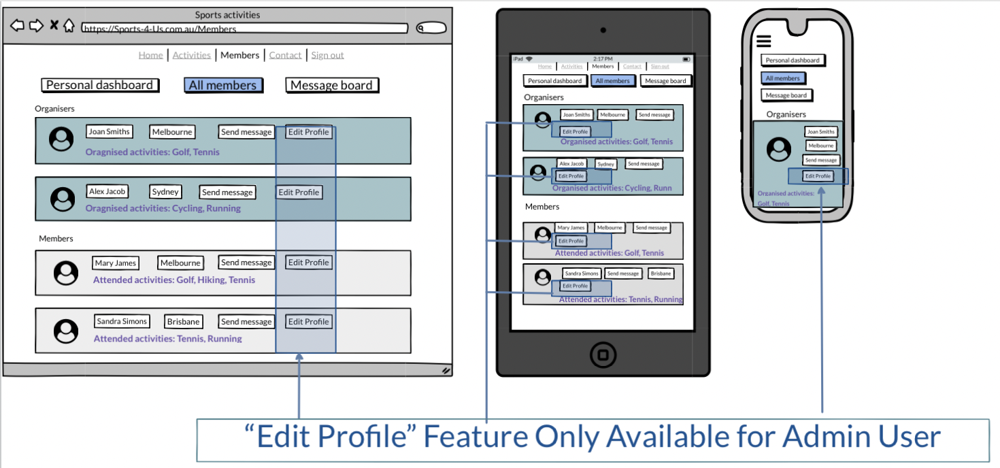

This page provides a list for all the members and organisers in the App. The Edit profile button will only be visible to the Admin. The user can do direct messaging from this page.

**5 - Direct Message Form**

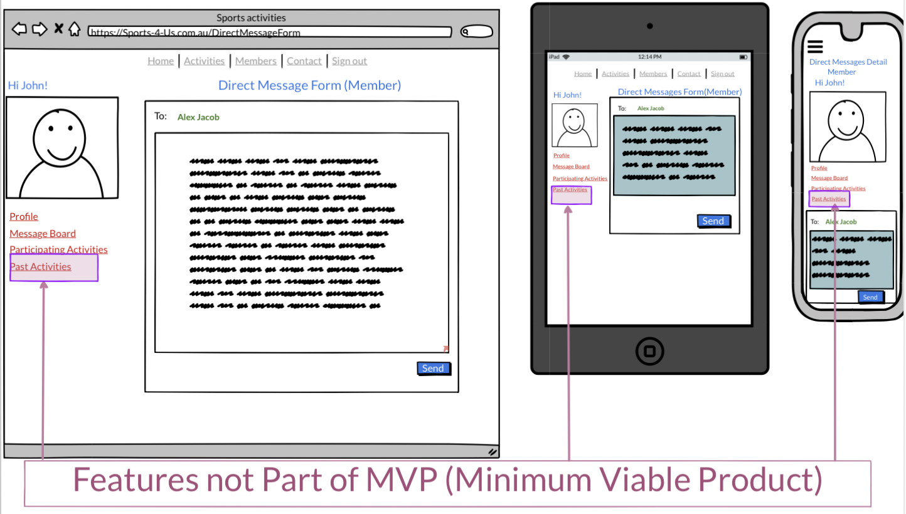

This page opens up when messaging button for a particular member in the previous wire frame is clicked. Past Activities is not part of the MVP design.

**6 - Participating Activities Page**

This page shows a full list of activities that the Member is participating in.

**7&8 - Message Board Page/Inbox Channel**

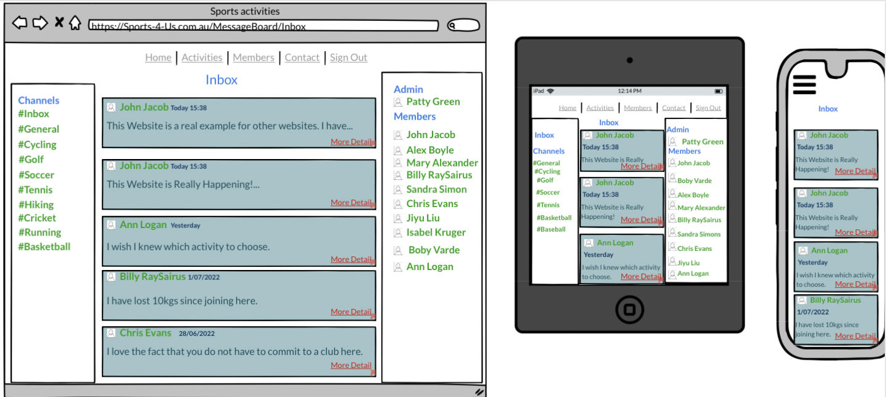

The Message board opens by default into to inbox page where the member can see their full list of personal messages.

**9 - Direct Message Reply Form**

This page opens up when the member wants to view the full message. There is a section below to type a reply and send it.

**10 - General Channel Page**

Here the members can post messages relating to general content and the messages will appear at the bottom.

**11 - Sport Category  Channels**

Here the members can post messages relating to a particular sporting category and the messages will appear at the bottom.

**12 - Past Activities(Not MVP)**

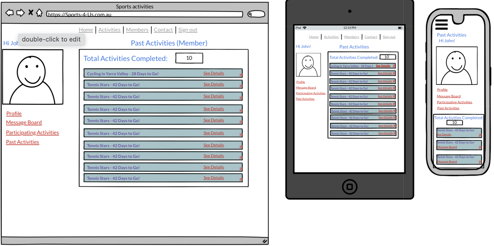

This gives the member a count on the total activities that was participated and give a full list of the activities. This is however not part of the MVP design.

### **C. Wireframes - Organiser Login**

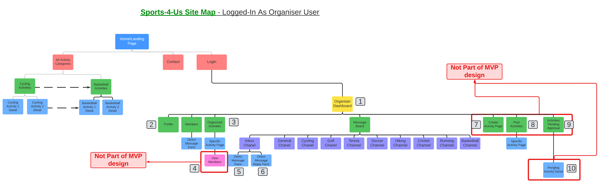

The above sitemap looks very similar to the Member one with a few exceptions:

- The Organiser can not book activities
- Organised activities instead of Participating Activities.
- Some items not part of MVP - view Members, Create Activity and Pending Activities.

**1 - Organiser Dashboard**

This is similar to the Member Dashboard with the main exception of Organised activities instead of Participating Activities.  Links to pending activities, create Activiites and Past activiites are not part of the MVP.

**2 - Profile**

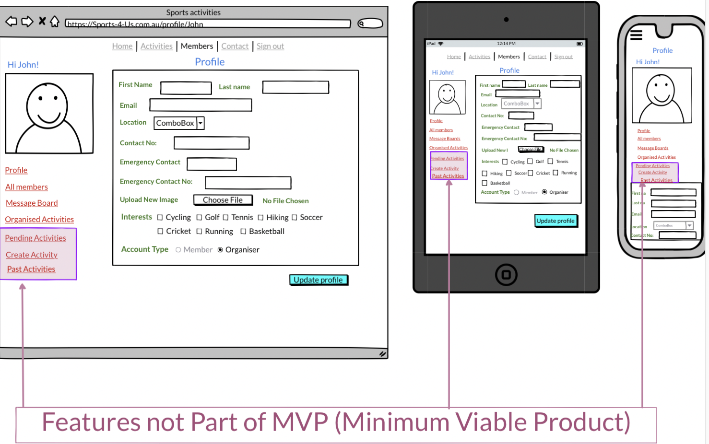

This is very similar to the previous profile page with a few changes in the nav bar as mentioned before.

**3 - Organised Activities**

This is very similar to the Participating Activities page shown earlier.

**4 - View Members(Not MVP)**

This is not part of the MVP, however will look very similar to the Members page in the previous section once implemented.

**5 -  Direct Message Form**

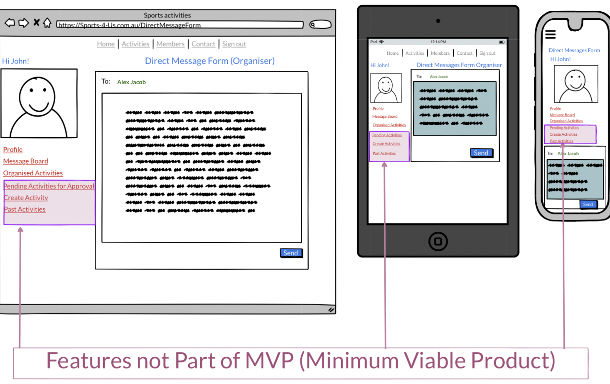

This is very similar to the previous Direct Message form with a few changes in the nav bar as mentioned before.

**6 - Direct Message Reply Form**

This is very similar to the previous Direct Message Reply page with a few changes in the nav bar as mentioned before.

**7 - Create Activity Page(Not MVP)**

This feature is currently not part of the MVP. When implemented the organiser will have the power to create and activity and submit it to Admin for approval.

**8 - Past Activities(Not MVP)**

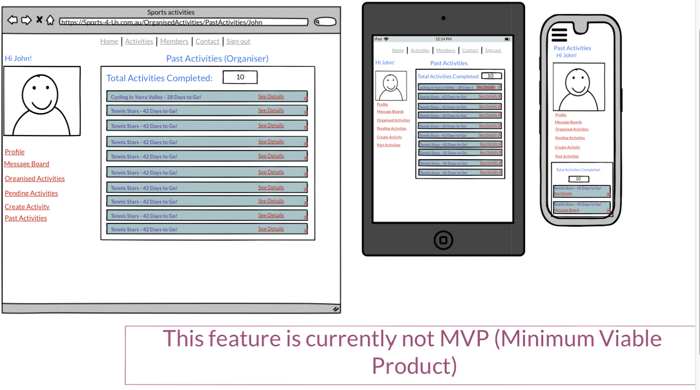

This feature is currently not part of the MVP. When implemented the organiser will be able to see a count of all the activities organsied and its full list.

**9 - Activities Pending Approval(Not MVP)** 

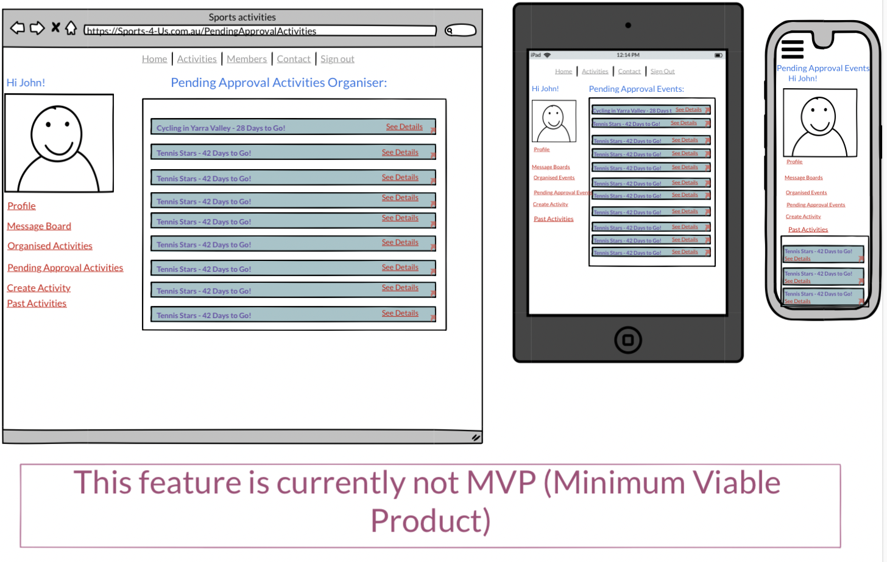

This feature is currently not part of the MVP. When implemented the organiser will be able to view activites that were created by them and waiting for approval.

**10 - Pending Activity Detail(Not MVP)**

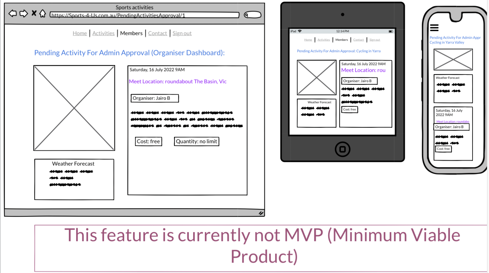

This feature is currently not part of the MVP. When implemented the organiser will be able to view details of the activities created by them and waiting for approval.

### **Wireframes - Admin Login**

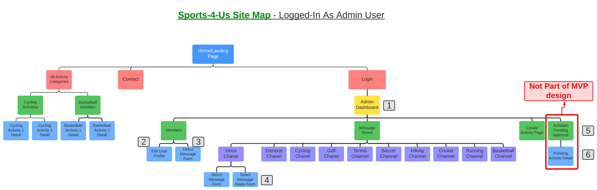

What is different here is the page where Admin can edit the User profile of any member. They can also create activities. Finally there in a non-MVP part where there are pages to view and Approve activities created by the Organiser.

**1 - Admin Dashboard**

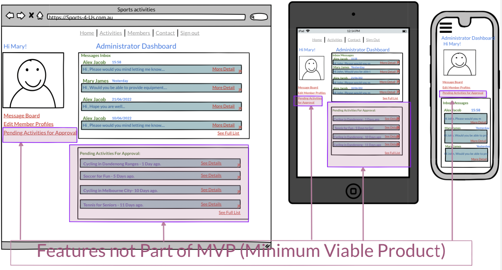

The navbar on the left is smaller and different to the other dashboards. There is a pending activity list which is not part of the MVP design. 

**2 - Edit User Profile**

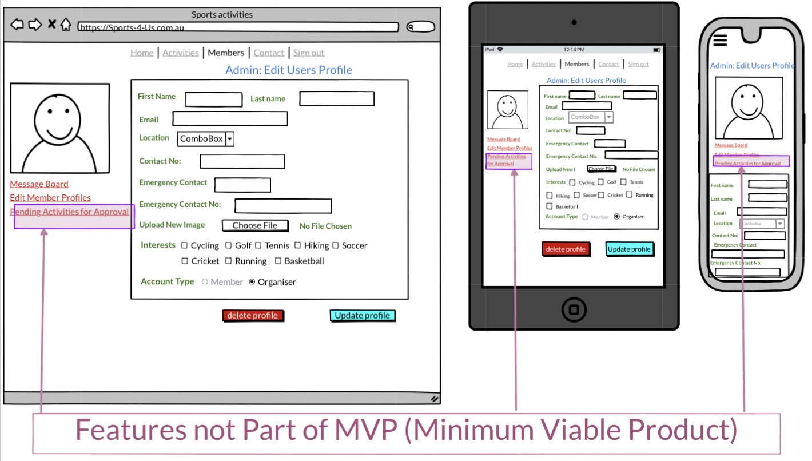

This page is very similar to the pages for members to edit their personal profiles, with the exception that there is a 'delete profile' button.
 
**3 - Direct Message Form**

This is very similar to the previous Direct Message Form page with a few changes in the nav bar as mentioned before.

**4 - Direct Message Reply Form**

This is very similar to the previous Direct Message Reply Form with a few changes in the nav bar as mentioned before.

**5 - Activity Pending Approval(Not MVP)**

This feature is currently not part of the MVP. When implemented the admin will be able to view full list of activities created by organisers and waiting for approval.

**6 - Pending Activity Detail(Not MVP)**

This feature is currently not part of the MVP. When implemented admin will be able to view details of the activities created by the Organisers and either approve or reject them.

## **Screenshots of your Trello board throughout the duration of the project**

In order to manage this project appropriately throughout the design and implementation process, the team has chossen to use Trello, which is a Software package that serves as Project Management tool.

The team has created two different boards to track and update the progress of the project:

- **Final Project Part A** Board: This will track and update the progress of the project in the Design phase of the project.
- **Final Project Part B** Board: This will track and update the progress of the project in the Implementation and Final Deployment phase of the project.

The links to both boards are shown below:

Part A - https://trello.com/b/HIMcvgnT/sports-4-us-part-a

Part B - https://trello.com/b/cmjtAiJB/sports-4-us-part-b

The rest of this section will provide screenshots and explanations on how the boards have changed and progressed through different stages of the project.

### Day 1

As it can be noticed above, the Trello board for Part A phase of the design process was set up. This board contains 8 cards/main tasks that need to be completed to ensure the completion of this phase. The first card activity("Description of Website") is set to start on 8/07/2022 and the last card Activity(Finalise README) is set to be completed on 16/07/2022. 
### Day 6

By Day 6 three card activities (Wireframes,Application Architecture and User Stories) have been fully completed. Dataflow diagrams were also completed, however needed more revising and tidying up. Trello Screenshots were progressing as required. "Description of website" was done halfway and the other two items(Presentation and README) had not been started, since it was not necessary at that stage.
### Day 8

As it can be seen here every card has progressed, except for the 'presentation' card. README document was done half-way and the same can be said about the 'Description of Website' card.
### Day 11

By Day 11, Data Flow Diagrams and 'Description of Website' were also fully completed. The presentation was done on paper and waiting to be presented. README had also progressed to almost completion.
### Day 14

As it can be noticed above, all tasks regardign Part A had been completed on time as required.

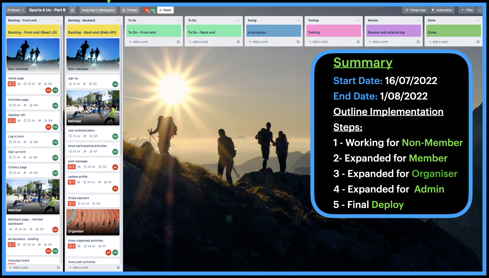

At this stage the team has had to look at planning for the next phase of the project. The Board above shows a large list of activities that are meant to be started on the 16/07/2022 and completed by 1/08/2022. This phase involves implementation of a Front End, a Back End and their integration. However the project will be tackled in 5 steps as shown below:

- First to get the App working for a **Guest** User,
- Second to get the App working for a **Member** User,
- Third to get it working for an **Organiser** User,
- Forth to get it working for the **Admin** User,
- Fifth to do a Final **Deployment**.

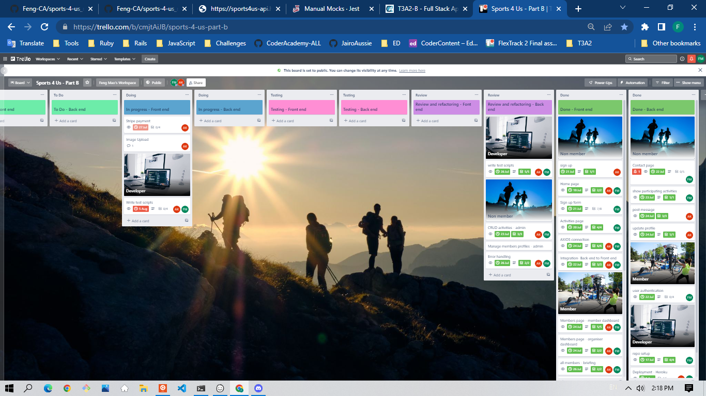

